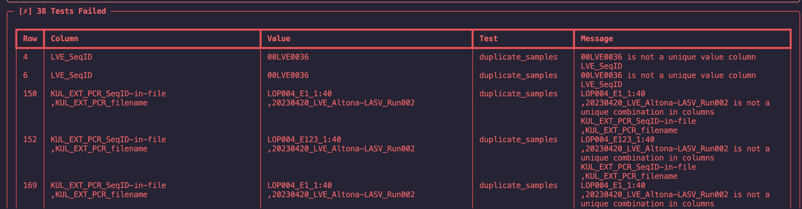

# Lab File Checker

Lab file checker is a set of simple rules in order to guarantee the that the excel file doesn't contain any corrupt or incorrect data.

## Installation

To install the tool, use pip and refer to the repository.

Requirements:

- python >=3.7
- setuptools
- pip

### Downloading the tool from the repository

```
pip install https://github.com/Joon-Klaps/LabFileChecker/archive/refs/heads/master.zip
```

You're all setup!

> It's possible that the required packages versions are clashing with those locally installed, if this is the case try creating a local environemnt using `conda create labfilechecker-env python=3.9.16` and try building again with `pip install`
>
> > if this also fails try `pip --upgrade --force-reinstall https://github.com/Joon-Klaps/LabFileChecker/archive/refs/heads/master.zip` to really force the installation

### Updating the installation

Updating is done again with pip:

```
pip install --upgrade https://github.com/Joon-Klaps/LabFileChecker/archive/refs/heads/master.zip
```

## Usage

```bash
$ labfilechecker --help
 Usage: labfilechecker [OPTIONS] FILE

 Arguments:
*    file      TEXT  [default: None] [required]

Options:
--report                TEXT        save the linting results to a excel file. [default: report.xlsx]
--export-report  --no-export-report save the linting results to a excel file. [default: export-report]
--config                TEXT        configuration file used to check the excel file. [default: config sheet in [file]]
--skip-tests            TEXT        skip the lists of tests: [column_names, duplicate_samples, dates, unrealistic_dates, numeric_values,
                                    presence_databaseID, referring_ids, allowed_values, presence_value]
--skiprows              INTEGER     Number of rows to skip at the beginning of the excel file. [default: 1]
--help                              Show this message and exit.
```

It requires two files:

- an excel file containing the necessary data to check
- a config file. If none is it will assume that in the given excel a sheet named 'config' is availble which contains information on which columns to check. A yml file can also be given.

### The config file

The config file contains the necessary information to determine the type of tests executed on certain columns.
Currently the following columns/keys are supported:

- Column_name
  - value: `name_of_column`
- Column_type
  - value: `unique-id|numeric|date|text`
- Allowed_values
  - value: `allowed,value,in,columns`, a series of values seperated by a single `,` the string will be split up based on `,`so spaces are not removed
- Is_referring_to:
  - value: `column_my_value_is_based_on` is used in test to check if the value exists in the column it's referring to.
- Separation_character
  - value: `_|+|;|...` a character seperation if the given values are a constructed of multiple values from another column. Values will be split up based on the given character
- Unique_with
  - value: `with_this_column_the_following_values_are_unique`, the combination of the two columns make the coming values unique and are uniquely associated to the row (if the row is not a continuation of another row).

### Tests

There are a total of 10 tests that can be passed. Note that there can be more warnings and failed tests as they dependent on the number of failed cell values

1. Column Names

   > Checks if all columns are present in the config file

2. Unique Columns:

   > Checks if the columns that should have unique values are really unique and don't have duplicate values

3. Unique Combinations:

   > Checks if the combination of given columns are unique and don't have duplicate values

4. Non-Existing-Dates:

   > Checks if all the values can be read as a date

5. Unrealistic Dates:

   > Checks if the date is inbetween current-date and current-date minus 6 years

6. Non-Existing-Numbers:

   > Checks if the value can be read as a number

7. Non-Existing-Ids:

   > Checks if the column to which the file is referring to contains all these values

8. Non-Existing-Ids with seperation character:

   > Checks if the IDs split up by the seperation character are present in the column to which they are referring to

9. Presence-database ID:

   > Checks if the sample category is a 'LASSA SAMPLE' contains a value for the patientID and specimenID, meaning it can be associated to a patient and a specific sample.

10. Allowed-Values:

    > Checks if the values of the column are in the range of the allowed values specified within the config file.

11. Presence-Values:
    > Checks if there are any blank values in the excel

### Terminal output

The terminal will display the results and show how many tests have `failed`, `warned`, `passed`, `skipped`.

- `failed` tests show critical errors, that will make data integration extremely more challenging and labour intensive
- `warned` tests show warnings, which mostly correspond to data loss when being integrated in a database
- `passed` tests show tests that completed without any issues.
- `skipped` tests show tests that were skipped either through an error that occurred or through specification.

All results are displayed in a table format that contain the identified row, the column, the type of test and a message that will help to solve the issue.

A snapshot of the result is shown:

